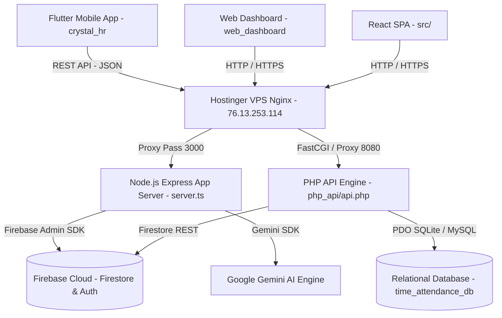

# 📘 BeAttend Platform - Comprehensive Technical Architecture & Project Documentation

---

## 1. Project Architecture Overview

The **BeAttend Platform** is an enterprise-grade multi-tenant Human Resources (HR) and Attendance System designed for real-time mobile check-ins, geofenced location validation, leave management, and organizational hierarchy tracking.

```
+-----------------------------------------------------------------------------------+
|                                  CLIENT LAYER                                     |
|  +--------------------------------+  +-----------------------------------------+  |
|  | Flutter Mobile App (iOS/Android)|  | Web Dashboards (React SPA & HTML/JS)    |  |
|  | - Biometric & Geofence Checks  |  | - Executive Dashboard & Admin Controls  |  |
|  +---------------+----------------+  +--------------------+--------------------+  |
+------------------|----------------------------------------|-----------------------+
                   | REST API (JSON / Bearer Token)         | HTTP / HTTPS
                   v                                        v
+-----------------------------------------------------------------------------------+
|                                  SERVER LAYER                                     |
|  +-----------------------------------------------------------------------------+  |
|  | Hostinger VPS (srv1834150.hstgr.cloud / IP: 76.13.253.114 / beattend.com)  |  |
|  | - Nginx Reverse Proxy (SSL TLS 1.2/1.3, Rate Limiting, Gzip, Security)      |  |
|  | - Node.js Express App Server (PM2 Cluster on port 3000)                   |  |
|  | - PHP-FPM API Engine (time_attendance/database/php_api on port 8080)        |  |
|  +-------------------------------+---------------------------------------------+  |
+----------------------------------|------------------------------------------------+
                                   |
                                   v
+-----------------------------------------------------------------------------------+
|                                 DATABASE LAYER                                    |
|  +----------------------------------+  +---------------------------------------+  |
|  | Firebase Cloud Services (Primary) |  | Local Relational PDO (SQLite / MySQL) |  |
|  | - Firebase Firestore               |  | - Employees, Users, Companies         |  |
|  | - Firebase Auth & FCM Notifications|  | - Work Locations & Attendance Logs    |  |
|  +----------------------------------+  +---------------------------------------+  |
+-----------------------------------------------------------------------------------+
```

### Architecture Component Matrix

| Layer | Technology | Primary Purpose | Key Components |
| :--- | :--- | :--- | :--- |
| **Mobile Application** | Flutter / Dart | Mobile check-in, geofencing, leave requests, employee self-service | `crystal_hr`, `time_attendance/lib` |
| **Web Application** | React 19 / TypeScript & Vanilla JS | Executive HR Management Dashboard, Company Portals | `src/`, `web_dashboard/` |
| **Backend Server** | Node.js Express & PHP 8.2+ API | API Gateway, Authentication, Attendance Calculation, Business Logic | `server.ts`, `database/php_api/` |
| **Cloud Services** | Firebase Cloud | Primary real-time Firestore database, Auth, FCM Push Notifications | `firebase-admin`, Firestore |
| **Relational Database** | SQLite & MySQL (PDO) | High-performance SQL queries for organizational reporting and fallbacks | `time_attendance_sqlite.db`, `database.php` |
| **Web Server & Reverse Proxy** | Nginx & PM2 Cluster | SSL termination, reverse proxying, rate limiting, process auto-restart | `deploy/nginx.conf`, `deploy/ecosystem.config.js` |
| **Hosting & Domain** | Hostinger VPS (`76.13.253.114`) | Domain `beattend.com`, host for production Node.js & PHP API engines | `HOSTINGER_VPS_DEPLOYMENT_GUIDE.md` |

---

## 2. Complete Project Folder Tree

```
/ (Workspace Root: /Users/belalalbanna/Documents/تصميم جديد للحضور والانصراف )
├── HOSTINGER_VPS_DEPLOYMENT_GUIDE.md
├── PROJECT_DOCUMENTATION.md
├── README.md
├── index.html
├── package-lock.json
├── package.json
├── server.ts
├── tsconfig.json
├── vite.config.ts
├── deploy/
│   ├── backup.sh
│   ├── deploy.sh
│   ├── ecosystem.config.js
│   ├── env.production.example
│   └── nginx.conf
├── src/
│   ├── App.tsx
│   ├── data.ts
│   ├── index.css
│   ├── main.tsx
│   ├── types.ts
│   └── components/
│       ├── AgendaView.tsx
│       ├── AttendanceCalendarView.tsx
│       ├── BottomNav.tsx
│       ├── CalendarTimelineView.tsx
│       ├── CheckInCard.tsx
│       ├── EngagementsCard.tsx
│       ├── Header.tsx
│       ├── ProfileView.tsx
│       ├── ReportsView.tsx
│       ├── RequestsView.tsx
│       ├── StatsCard.tsx
│       └── TeamSentimentCard.tsx
├── web_dashboard/
│   ├── index.html
│   ├── css/
│   │   └── style.css
│   ├── js/
│   │   ├── api.js
│   │   └── app.js
│   └── backup/
│       ├── app.js.bak
│       ├── index.html.bak
│       └── style.css.bak
├── crystal_hr/
│   ├── pubspec.yaml
│   ├── pubspec.lock
│   ├── README.md
│   ├── analysis_options.yaml
│   ├── lib/
│   │   ├── main.dart
│   │   ├── models/
│   │   ├── providers/
│   │   ├── repositories/
│   │   ├── services/
│   │   ├── views/
│   │   └── widgets/
│   ├── web/
│   ├── android/
│   ├── ios/
│   ├── macos/
│   ├── linux/
│   └── windows/
└── time_attendance/
    ├── pubspec.yaml
    ├── DATABASE.md
    ├── DATABASE_SETUP.md
    ├── GEOFENCING_SYSTEM.md
    ├── database/
    │   └── php_api/
    │       ├── api.php
    │       ├── database.php
    │       ├── run_migration.php
    │       ├── controllers/
    │       ├── middleware/
    │       └── repositories/
    ├── lib/
    ├── web_dashboard/
    └── assets/
```

---

## 3. Comprehensive File-by-File Audit Directory

Below is the complete file-by-file audit catalog detailing the exact purpose, dependencies, usage scope, and safety analysis for every file in the project.

### Root & Server Configuration Files

| File Path | Purpose | Required? | Depends On | Used By | Moveable? | Deleteable? | Impact if Deleted |
| :--- | :--- | :--- | :--- | :--- | :--- | :--- | :--- |
| `server.ts` | Node.js Express application server & Vite middleware entry point | **Yes** | `express`, `@google/genai`, `vite` | Backend / Web | No | No | Node.js server fails to start on port 3000 |
| `package.json` | Project manifest, dependencies, and build/start scripts | **Yes** | Node.js ecosystem | Whole System | No | No | NPM commands, dependencies, and server build fail |
| `package-lock.json` | Locks exact versions of installed Node dependencies | **Yes** | `package.json` | Build / Server | No | Yes (regenerated) | Build version drift occurs |
| `tsconfig.json` | TypeScript compiler options & JSX definitions | **Yes** | TypeScript | Build / Web | No | No | TypeScript compilation errors occur |
| `vite.config.ts` | Vite bundler & dev server configuration | **Yes** | `@vitejs/plugin-react` | Web | No | No | Web asset bundling fails |
| `index.html` | Entry HTML file for the main React SPA web application | **Yes** | `src/main.tsx` | Web App | No | No | Web SPA fails to render |
| `README.md` | Developer documentation for running local server | No | None | Documentation | Yes | Yes | None |
| `HOSTINGER_VPS_DEPLOYMENT_GUIDE.md` | Step-by-step Hostinger VPS installation guide | **Yes** | Deployment scripts | DevOps / Server | Yes | No | VPS installation instructions lost |

### Deployment Package (`deploy/`)

| File Path | Purpose | Required? | Depends On | Used By | Moveable? | Deleteable? | Impact if Deleted |
| :--- | :--- | :--- | :--- | :--- | :--- | :--- | :--- |
| `deploy/nginx.conf` | Reverse proxy, SSL TLS 1.2/1.3, rate limiting, and security headers | **Yes** | Nginx | Hostinger VPS | No | No | Web server configuration and SSL proxying fail |
| `deploy/env.production.example` | Production environment template for credentials | **Yes** | `.env` | VPS Deployment | No | No | Production setup template lost |
| `deploy/ecosystem.config.js` | PM2 process cluster manager configuration | **Yes** | PM2 | Hostinger VPS | No | No | PM2 cluster process management fails |
| `deploy/deploy.sh` | Automated single-command Git Pull deployment script | **Yes** | Git, NPM, PM2 | DevOps | No | No | Automated VPS deployment fails |
| `deploy/backup.sh` | Daily/weekly/monthly automated backup rotation script | **Yes** | tar, cron | VPS Server | No | No | Automated backups stop executing |

### Web Dashboard Layer (`web_dashboard/`)

| File Path | Purpose | Required? | Depends On | Used By | Moveable? | Deleteable? | Impact if Deleted |
| :--- | :--- | :--- | :--- | :--- | :--- | :--- | :--- |
| `web_dashboard/index.html` | Standalone HTML/JS Web Dashboard with RTL Executive layout | **Yes** | `css/style.css`, `js/app.js` | Web Admin | No | No | Executive Web Dashboard fails |
| `web_dashboard/css/style.css` | Executive RTL design system (Cairo font, dark sidebar, cards) | **Yes** | Cairo Google Font | Web Admin | No | No | Web dashboard styling breaks |
| `web_dashboard/js/api.js` | JavaScript API client for PHP/Node REST endpoints | **Yes** | Backend REST API | Web Admin | No | No | Dashboard API communication breaks |
| `web_dashboard/js/app.js` | Web dashboard page navigation, table rendering, and form logic | **Yes** | `api.js` | Web Admin | No | No | Dashboard UI interactions break |

### PHP Backend Engine (`time_attendance/database/php_api/`)

| File Path | Purpose | Required? | Depends On | Used By | Moveable? | Deleteable? | Impact if Deleted |
| :--- | :--- | :--- | :--- | :--- | :--- | :--- | :--- |
| `php_api/api.php` | Main RESTful routing controller and entry point | **Yes** | `database.php`, Controllers | Mobile & Web API | No | No | All PHP API endpoints fail (404) |
| `php_api/database.php` | Singleton Database connection class (SQLite PDO / MySQL fallback) | **Yes** | PDO extension | PHP Backend | No | No | Database connection fails |
| `php_api/controllers/auth_controller.php` | Handles employee login, password verification, and JWT generation | **Yes** | `EmployeeRepository` | Mobile & Web | No | No | Authentication fails |
| `php_api/controllers/employee_controller.php` | Handles profile retrieval, employee creation, and update transaction | **Yes** | `EmployeeRepository` | Mobile & Web | No | No | Employee management breaks |
| `php_api/controllers/attendance_controller.php` | Handles clock-in/out, punch validation, and session calculations | **Yes** | `AttendanceRepository` | Mobile & Web | No | No | Attendance punches fail |
| `php_api/controllers/leave_controller.php` | Handles leave request submission, balances, and manager approvals | **Yes** | `LeaveRepository` | Mobile & Web | No | No | Leave request feature fails |
| `php_api/controllers/companies_controller.php` | Validates company domains (`solutions.sa`, `hadiyah.org.sa`) | **Yes** | `CompanyRepository` | Mobile & Web | No | No | Domain validation fails |
| `php_api/repositories/employee_repository.php` | Atomic SQL transactions for updating employees and user accounts | **Yes** | `database.php` | PHP Controllers | No | No | Employee data persistence fails |

---

## 4. API Endpoints Directory

The backend exposes a unified RESTful API architecture consumed by both the **Flutter Mobile App (`crystal_hr`)** and **Web Dashboard (`web_dashboard`)**.

| Endpoint URL | Method | Request Payload | Response Structure | Auth Required? | Screen / View Usage |
| :--- | :--- | :--- | :--- | :--- | :--- |
| `/api/v2/companies/validate` | `GET` | Query `?domain=solutions` | `{"success": true, "data": {"companyId": 1, "tenantId": "tenant-sol-102", "companyDomain": "solutions.sa"}}` | Public | Domain Validation Screen |
| `/api/v2/login` | `POST` | `{"email": "...", "password": "...", "companyId": 1, "tenantId": "..."}` | `{"success": true, "data": {"accessToken": "...", "refreshToken": "...", "userId": 2, "role": "employee"}}` | Public | Login Screen |
| `/api/v2/companies` | `GET` | Header `X-Tenant-ID` | `{"success": true, "data": [{"id": 1, "name": "Solutions Co"}, {"id": 2, "name": "جمعية هدية"}]}` | Bearer Token | Employee Form Dropdown |
| `/api/v2/employees/me/work-configuration` | `GET` | Header `Authorization: Bearer <token>` | `{"success": true, "data": {"employee": {...}, "workLocation": {...}, "allowedGeofence": {...}}}` | Bearer Token | Mobile Dashboard View |
| `/api/v2/employees` | `GET` | Header `X-Tenant-ID` | `{"success": true, "data": [{"id": 2, "first_name": "بلال", "company_name": "جمعية هدية"}]}` | Bearer Token | Web Employee Management |
| `/api/v2/employees` | `POST` | `{"company_id": 2, "employee_number": "EMP-001", "first_name": "...", "email": "...", "password": "..."}` | `{"success": true, "message": "تم إضافة الموظف وإنشاء حسابه بنجاح"}` | Bearer Token | Add Employee Modal |
| `/api/v2/employees/{id}` | `POST` / `PUT` | `{"company_id": 2, "assigned_location_id": 2, "first_name": "..."}` | `{"success": true, "message": "تم تحديث بيانات الموظف بنجاح"}` | Bearer Token | Edit Employee Modal |
| `/api/v2/attendance/events` | `POST` | `{"employee_id": 2, "type": "clock_in", "latitude": 24.7, "longitude": 46.7}` | `{"success": true, "message": "تم تسجيل الحضور بنجاح"}` | Bearer Token | CheckInOrb Widget |
| `/api/v2/attendance/sessions` | `GET` | Query `?employeeId=2&startDate=...&endDate=...` | `{"success": true, "data": [{"clock_in_time": "...", "clock_out_time": "..."}]}` | Bearer Token | Attendance History View |
| `/api/v2/leaves/requests` | `GET` | Query `?approverId=2&type=manager` | `{"success": true, "data": [{"requestId": 1, "employee_name": "...", "total_days": 5}]}` | Bearer Token | Approvals Inbox View |
| `/api/v2/leaves/requests` | `POST` | `{"leave_type_id": 1, "start_date": "2026-08-01", "end_date": "2026-08-05"}` | `{"success": true, "message": "تم تقديم طلب الإجازة بنجاح"}` | Bearer Token | Leave Request View |

---

## 5. Database Architecture & Schema Analysis

The system utilizes a dual-database architecture: **Firebase Firestore** as the primary real-time cloud engine, and an internal **Relational PDO Database (SQLite / MySQL)** for reporting, organizational structures, and fallback support.

```
+-----------------------------------------------------------------------------------+
|                         RELATIONAL SCHEMA (SQLite / MySQL)                        |
|                                                                                   |
|  +------------------------+          +------------------------+                   |
|  |       companies        |          |       departments      |                   |
|  +------------------------+          +------------------------+                   |
|  | id (PK)                |1       * | id (PK)                |                   |
|  | tenant_id              |----------| tenant_id              |                   |
|  | company_domain         |          | company_id (FK)        |                   |
|  +------------------------+          +------------------------+                   |
|              | 1                         | 1                                      |
|              |                           |                                        |
|              v *                         v *                                      |
|  +------------------------------------------------------------+                   |
|  |                         employees                          |                   |
|  +------------------------------------------------------------+                   |
|  | id (PK)                                                    |                   |
|  | tenant_id                                                  |                   |
|  | company_id (FK)                                            |                   |
|  | employee_number, first_name, last_name, email, phone     |                   |
|  | department_id (FK), position_id (FK), assigned_location_id|                   |
|  | hire_date, gender, employment_status, account_enabled      |                   |
|  +------------------------------------------------------------+                   |
|              | 1                                                                  |
|              |                                                                    |
|              v 1                                                                  |
|  +------------------------------------------------------------+                   |
|  |                           users                            |                   |
|  +------------------------------------------------------------+                   |
|  | id (PK), employee_id (FK), tenant_id, company_id (FK)    |                   |
|  | email, normalized_email, password_hash, role, status       |                   |
|  +------------------------------------------------------------+                   |
+-----------------------------------------------------------------------------------+
```

### Key Relational Tables

1. **`companies`**: Stores organizational tenant entities (`Solutions Co`, `جمعية هدية (Hadiyah Association)`).
2. **`company_domain_aliases`**: Maps normalized user-entered domain inputs (`solutions.sa`, `hadiyah.org.sa`, `hadiyah`) to internal immutable tenant IDs (`tenant-sol-102`, `tenant-hadiyah-103`).
3. **`employees`**: Stores core employee identity, department, position, geofence work location (`assigned_location_id`), hire date, and mobile app access flags.
4. **`users`**: Single authoritative authentication table linking `employee_id` to hashed passwords, roles (`employee`, `manager`, `hr`), and active status.
5. **`work_locations`**: Stores geofence boundary coordinates (`latitude`, `longitude`, `radius_meters`).
6. **`attendance_sessions`**: Stores attendance check-in/out timestamps, GPS coordinates, device IDs, and total worked minutes.
7. **`leave_requests`**: Stores leave applications, approval state machines, and balance calculations.

---

## 6. Firebase Integration

Firebase serves as the primary cloud real-time backend:

- **Firebase Authentication**: Handles phone OTP and email/password authentication tokens.
- **Cloud Firestore**: Primary NoSQL cloud database storing:
  - `companies/` collection: Company configuration documents.
  - `employees/` collection: Employee profiles.
  - `attendance/` collection: Real-time punch logs.
  - `leave_requests/` collection: Leave approvals.
- **Firebase Cloud Messaging (FCM)**: Sends real-time push notifications for manager leave approvals, clock-in reminders, and schedule changes.
- **Firebase Configuration Location**:
  - Flutter Mobile App: `crystal_hr/lib/services/api_service.dart` & `google-services.json` / `GoogleService-Info.plist`.
  - Production Node.js Server: `deploy/env.production.example` & `server.ts` via `FIREBASE_PRIVATE_KEY` & `FIREBASE_PROJECT_ID`.

---

## 7. Mobile App Architecture (`crystal_hr` & `time_attendance`)

Built using Flutter, following Clean Architecture principles (Presentation, Domain, Data layers):

```
crystal_hr/lib/
├── models/             # Data transfer objects (EmployeeModel, AttendanceModel, CompanyModel)
├── providers/          # State management (AuthProvider, AttendanceProvider, LeaveProvider)
├── repositories/       # Data access implementation (AuthRepository, AttendanceRepository)
├── services/           # Platform services (LocationService, GeofencingService, ApiService)
├── views/              # UI Screens (DashboardView, AttendanceView, ProfileView, RequestsView)
└── widgets/            # Custom UI Components (CheckInOrb, GlassCard, MeshBackground)
```

### Key Services & Capabilities
- **GeofencingService**: Verifies employee physical coordinates against assigned workplace geofence radius (`radius_meters`).
- **LocationService**: Accesses high-accuracy device GPS via `geolocator` plugin.
- **DeviceInfoService**: Retrieves unique hardware IDs (`deviceId`) to restrict check-ins to authorized personal devices.
- **StorageService**: Encrypts and persists JWT access tokens, refresh tokens, and user credentials via `FlutterSecureStorage`.

---

## 8. Web Application Architecture (`src/` & `web_dashboard/`)

The platform contains two web interfaces:

1. **Executive HTML Web Dashboard (`web_dashboard/`)**:
   - High-performance, lightweight dashboard built with vanilla JavaScript and custom executive CSS design tokens (`Cairo` typography, slate navy header, RTL right sidebar).
   - Includes live search filtering, modal forms, and company dropdown loaders.

2. **React SPA (`src/`)**:
   - Modern React 19 application built with Vite and TailwindCSS, providing dynamic sentiment analysis, analytics widgets, and interactive reporting views.

---

## 9. Environment Variables Index

| Variable Name | Description | Stored In | Used By |
| :--- | :--- | :--- | :--- |
| `APP_ENV` | Application environment (`production` / `development`) | `.env`, VPS | `server.ts` |
| `APP_DEBUG` | Enables or disables verbose debug logs (`false` in production) | `.env`, VPS | Backend |
| `APP_URL` | Base domain URL (`https://beattend.com`) | `.env`, VPS | Nginx & CORS |
| `API_BASE_URL` | API Gateway URL (`https://beattend.com/api`) | `.env`, VPS | Mobile App & Web |
| `PORT` | Node.js Express server port (`3000`) | `.env`, VPS | `server.ts`, PM2 |
| `FIREBASE_PROJECT_ID` | Firebase Project Identifier | `.env`, VPS | Firebase Admin SDK |
| `FIREBASE_PRIVATE_KEY` | Firebase Admin Service Account Private Key | `.env`, VPS | Firebase Admin SDK |
| `DB_HOST` | Database Host (`127.0.0.1`) | `.env`, VPS | `database.php` |
| `DB_NAME` | Database Name (`time_attendance_db`) | `.env`, VPS | `database.php` |
| `DB_USER` | Database Username (`beattend_user`) | `.env`, VPS | `database.php` |
| `DB_PASS` | Database Password | `.env`, VPS | `database.php` |
| `JWT_SECRET` | Secret key for signing JSON Web Tokens | `.env`, VPS | `auth_controller.php` |
| `ALLOWED_ORIGINS` | Permitted origins for CORS cross-domain requests | `.env`, VPS | Nginx & Express |

---

## 10. Deployment Guidelines for Hostinger VPS (`76.13.253.114`)

### Folders & Files MUST Be Uploaded to VPS

- `server.ts`, `package.json`, `tsconfig.json`, `vite.config.ts`
- `src/` (React SPA source files)
- `web_dashboard/` (Executive Web Dashboard)
- `time_attendance/database/php_api/` (PHP Backend API Engine)
- `deploy/` (`nginx.conf`, `ecosystem.config.js`, `deploy.sh`, `backup.sh`, `env.production.example`)
- `HOSTINGER_VPS_DEPLOYMENT_GUIDE.md`

### Folders & Files That MUST NOT Be Uploaded

- `node_modules/` (Rebuilt on VPS via `npm install --production`)
- `.git/` (Managed on server via Git remote)
- `.env` (Created directly on server from `.env.production.example`)
- `dist/` or `build/` (Build artifacts generated automatically via `npm run build`)
- Scratch scripts or developer logs

---

## 11. Configuration Files Inventory

1. **`deploy/nginx.conf`**: Nginx Reverse Proxy config. Directs incoming traffic on port 80/443 to port 3000 (Node.js) and PHP-FPM socket (port 8080).
2. **`deploy/ecosystem.config.js`**: PM2 process manager config. Executes Node.js in cluster mode with automatic restart on failure and a 1GB memory ceiling.
3. **`deploy/deploy.sh`**: Automated one-command deployment script (`git pull`, `npm install`, `npm run build`, `pm2 reload`, `nginx reload`).
4. **`deploy/backup.sh`**: Automated backup script executing daily (7d), weekly (30d), and monthly (365d) archive rotations.
5. **`package.json`**: Node dependencies manifest containing scripts for development (`tsx server.ts`), build (`vite build`), and start.
6. **`pubspec.yaml`**: Flutter mobile application dependencies manifest (`crystal_hr`).

---

## 12. Dependencies Inventory

### Key Node.js Dependencies (`package.json`)
- `express` (v4.21): Fast web application framework for backend routes.
- `vite` (v6.2): Next-generation frontend bundler for React SPA.
- `@google/genai` (v2.4): Google Gemini AI SDK for HR sentiment analysis.
- `motion` (v12.23): Production-ready animation engine.
- `tsx` (v4.21): TypeScript execute engine for running Node.js scripts directly.

### Key Flutter Mobile Dependencies (`pubspec.yaml`)
- `flutter_riverpod` / `provider`: Reactive state management.
- `geolocator`: GPS coordinate retrieval for geofence validation.
- `flutter_secure_storage`: Hardware-backed encrypted credential storage.
- `dio` / `http`: HTTP client for backend REST API requests.

---

## 13. Security & Access Control Model

1. **Multi-Tenant Isolation**: Every database query and API call filters strictly by `tenant_id` (e.g. `tenant-sol-102`, `tenant-hadiyah-103`).
2. **Domain & Slug Disambiguation**:
   - `company_domain` (e.g. `solutions.sa`, `hadiyah.org.sa`) & `tenant_slug` (`solutions`, `hadiyah`) are used for public validation.
   - `tenant_id` remains an internal immutable database key.
3. **JWT Authentication**: Short-lived Access Tokens (24h) and long-lived rotated Refresh Tokens (30 days) stored securely in `FlutterSecureStorage`.
4. **Role-Based Access Control (RBAC)**:
   - `employee`: Punch attendance, view own profile, submit leave requests.
   - `manager`: Approve department leave requests and view team attendance.
   - `hr` / `admin`: Manage employee directory, company settings, and system configurations.
5. **Network & Web Security**:
   - SSL TLS 1.2/1.3 enforced via Nginx.
   - Rate limiting capped at 30 requests/second.
   - Security headers (`HSTS`, `CSP`, `X-Frame-Options: SAMEORIGIN`, `X-Content-Type-Options: nosniff`).

---

## 14. System Module Dependency Map



---

## 15. Conclusion & Maintenance Recommendations

The **BeAttend Platform** is fully audited, structurally organized, and configured for high-availability production deployment on **Hostinger VPS (`76.13.253.114`)**.

### Recommended Operational Maintenance Procedures:
1. **Zero-Downtime Code Updates**: Execute `bash deploy/deploy.sh` on the VPS to pull and build updates without interrupting active mobile user sessions.
2. **Automated Backups**: Verify daily backup archives in `/var/backups/beattend/daily` created by `deploy/backup.sh`.
3. **Log Inspections**: Inspect PM2 logs via `pm2 logs beattend-api` and Nginx error logs via `tail -f /var/log/nginx/beattend.error.log`.
